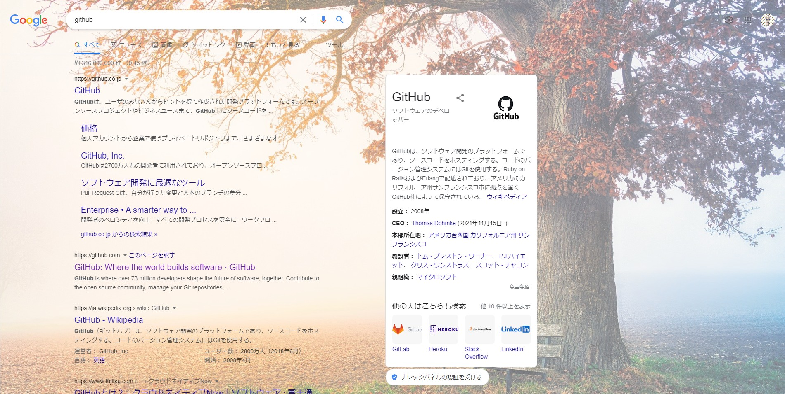
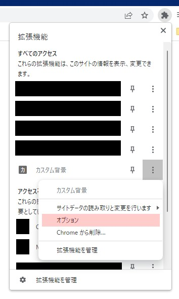

# カスタム背景
**Chrome Webストア**：https://chrome.google.com/webstore/detail/%E3%82%AB%E3%82%B9%E3%82%BF%E3%83%A0%E8%83%8C%E6%99%AF/piongplbpdlejkclhmphdcpfbhiimcao

Webページ（検索エンジン等）の背景にお好みの画像を挿入するChrome拡張機能です。設定したページに対して、予め選択した画像（の中からランダムで1枚）を背景として表示します。

- 上記画像はサンプルです。
- サンプルの作成にあたって、[pixabay](https://pixabay.com/ja/photos/%e6%9c%a8-%e5%85%ac%e5%9c%92%e3%81%ae%e3%83%99%e3%83%b3%e3%83%81-%e7%a7%8b-6792528/)の画像を使用しました。

## 使い方
Chrome Webストアより拡張機能をインストールして下さい。

拡張機能の設定（オプション）より、壁紙の設定、適用サイトの設定を行ってください。

